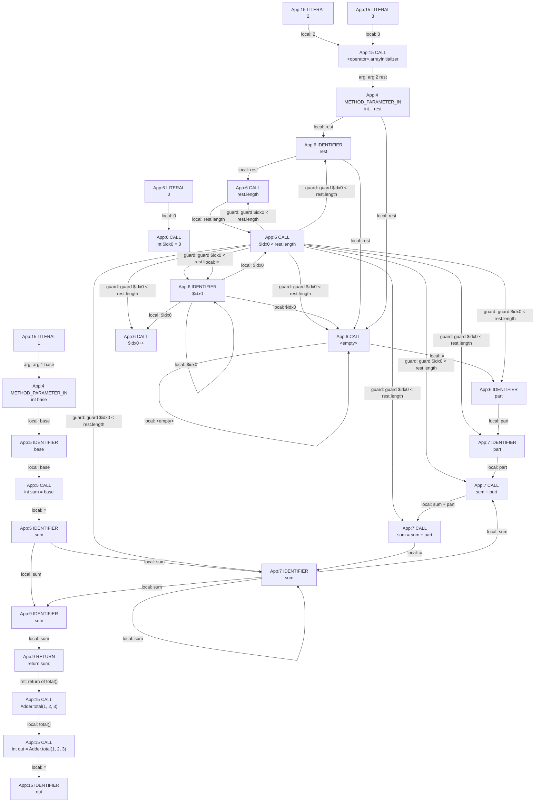

# varargs: spike value graph

```mermaid
flowchart TD
  n0["App:15 CALL<br/>#lt;operator#gt;.arrayInitializer"]
  n1["App:15 CALL<br/>Adder.total(1, 2, 3)"]
  n2["App:15 CALL<br/>int out = Adder.total(1, 2, 3)"]
  n3["App:15 IDENTIFIER<br/>out"]
  n4["App:15 LITERAL<br/>1"]
  n5["App:15 LITERAL<br/>2"]
  n6["App:15 LITERAL<br/>3"]
  n7["App:4 METHOD_PARAMETER_IN<br/>int base"]
  n8["App:4 METHOD_PARAMETER_IN<br/>int... rest"]
  n9["App:5 CALL<br/>int sum = base"]
  n10["App:5 IDENTIFIER<br/>base"]
  n11["App:5 IDENTIFIER<br/>sum"]
  n12["App:6 CALL<br/>#lt;empty#gt;"]
  n13["App:6 CALL<br/>$idx0 #lt; rest.length"]
  n14["App:6 CALL<br/>$idx0++"]
  n15["App:6 CALL<br/>int $idx0 = 0"]
  n16["App:6 CALL<br/>rest.length"]
  n17["App:6 IDENTIFIER<br/>$idx0"]
  n18["App:6 IDENTIFIER<br/>part"]
  n19["App:6 IDENTIFIER<br/>rest"]
  n20["App:6 LITERAL<br/>0"]
  n21["App:7 CALL<br/>sum + part"]
  n22["App:7 CALL<br/>sum = sum + part"]
  n23["App:7 IDENTIFIER<br/>part"]
  n24["App:7 IDENTIFIER<br/>sum"]
  n25["App:9 IDENTIFIER<br/>sum"]
  n26["App:9 RETURN<br/>return sum;"]
  n0 -->|"arg: arg 2 rest"| n8
  n1 -->|"local: total()"| n2
  n10 -->|"local: base"| n9
  n11 -->|"local: sum"| n24
  n11 -->|"local: sum"| n25
  n12 -->|"local: #lt;empty#gt;"| n12
  n12 -->|"local: ="| n18
  n13 -->|"guard: guard $idx0 #lt; rest.length"| n12
  n13 -->|"guard: guard $idx0 #lt; rest.length"| n14
  n13 -->|"guard: guard $idx0 #lt; rest.length"| n16
  n13 -->|"guard: guard $idx0 #lt; rest.length"| n17
  n13 -->|"guard: guard $idx0 #lt; rest.length"| n18
  n13 -->|"guard: guard $idx0 #lt; rest.length"| n19
  n13 -->|"guard: guard $idx0 #lt; rest.length"| n21
  n13 -->|"guard: guard $idx0 #lt; rest.length"| n22
  n13 -->|"guard: guard $idx0 #lt; rest.length"| n23
  n13 -->|"guard: guard $idx0 #lt; rest.length"| n24
  n15 -->|"local: ="| n17
  n16 -->|"local: rest.length"| n13
  n17 -->|"local: $idx0"| n12
  n17 -->|"local: $idx0"| n13
  n17 -->|"local: $idx0"| n14
  n17 -->|"local: $idx0"| n17
  n18 -->|"local: part"| n23
  n19 -->|"local: rest"| n12
  n19 -->|"local: rest"| n16
  n2 -->|"local: ="| n3
  n20 -->|"local: 0"| n15
  n21 -->|"local: sum + part"| n22
  n22 -->|"local: ="| n24
  n23 -->|"local: part"| n21
  n24 -->|"local: sum"| n21
  n24 -->|"local: sum"| n24
  n24 -->|"local: sum"| n25
  n25 -->|"local: sum"| n26
  n26 -->|"ret: return of total()"| n1
  n4 -->|"arg: arg 1 base"| n7
  n5 -->|"local: 2"| n0
  n6 -->|"local: 3"| n0
  n7 -->|"local: base"| n10
  n8 -->|"local: rest"| n12
  n8 -->|"local: rest"| n19
  n9 -->|"local: ="| n11
```
