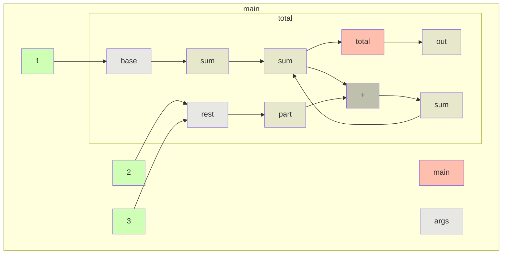

```mermaid
flowchart TD
  subgraph b0["main"]
    n1[main]:::RETURN
    n2[args]:::FUNC_PARAM
    n3[1]:::LITERAL
    n4[2]:::LITERAL
    n5[3]:::LITERAL
    n15[out]:::VARIABLE
    n3[1]:::LITERAL --> n8[base]:::FUNC_PARAM
    n4[2]:::LITERAL --> n9[rest]:::FUNC_PARAM
    n5[3]:::LITERAL --> n9[rest]:::FUNC_PARAM
    subgraph b6["total"]
      n7[total]:::RETURN
      n8[base]:::FUNC_PARAM
      n9[rest]:::FUNC_PARAM
      n10[sum]:::VARIABLE
      n11[sum]:::VARIABLE
      n12[part]:::VARIABLE
      n13[+]:::BIN_OP
      n14[sum]:::VARIABLE
      n7[total]:::RETURN --> n15[out]:::VARIABLE
      n8[base]:::FUNC_PARAM --> n10[sum]:::VARIABLE
      n9[rest]:::FUNC_PARAM --> n12[part]:::VARIABLE
      n10[sum]:::VARIABLE --> n11[sum]:::VARIABLE
      n11[sum]:::VARIABLE --> n13[+]:::BIN_OP
      n11[sum]:::VARIABLE --> n7[total]:::RETURN
      n12[part]:::VARIABLE --> n13[+]:::BIN_OP
      n13[+]:::BIN_OP --> n14[sum]:::VARIABLE
      n14[sum]:::VARIABLE --> n11[sum]:::VARIABLE
    end
  end
  classDef LITERAL fill:#00FF0030
  classDef VARIABLE fill:#80808030
  classDef BIN_OP fill:#80808080
  classDef FUNC_PARAM fill:#8080FF30
  classDef RETURN fill:#FF808080
  classDef EXTERNAL fill:#FFA50040
  classDef UNMODELLED fill:#FF000030,stroke-dasharray: 4 2
```
