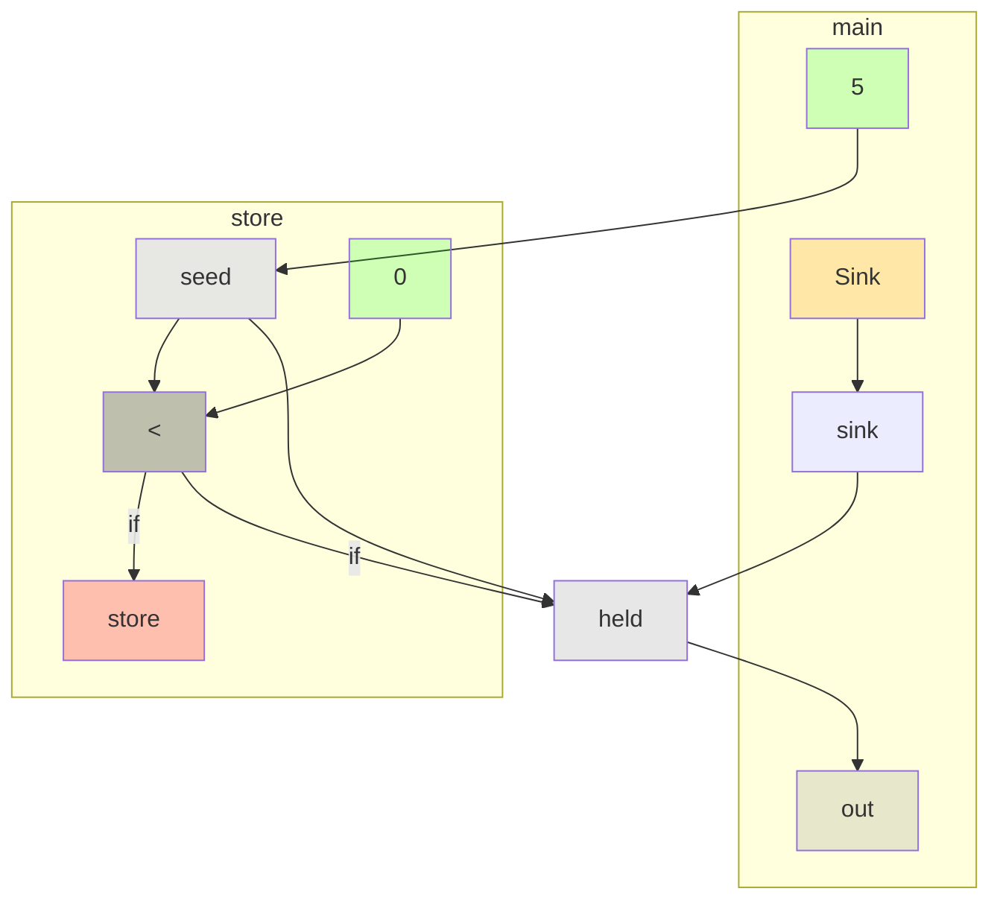

# voidReturn: spike value graph (condensed)

```mermaid
flowchart TD
  subgraph m0["main"]
    n0["Sink"]:::EXTERNAL
    n1["5"]:::LITERAL
    n2["out"]:::VARIABLE
    n3["sink"]:::OBJ_VARIABLE
  end
  subgraph m1["store"]
    n4["#lt;"]:::BIN_OP
    n5["seed"]:::FUNC_PARAM
    n6["0"]:::LITERAL
    n7["store"]:::RETURN
  end
  n8["held"]:::VARIABLE
  n0 --> n3
  n1 --> n5
  n3 --> n8
  n4 -->|if| n7
  n4 -->|if| n8
  n5 --> n4
  n5 --> n8
  n6 --> n4
  n8 --> n2
  classDef LITERAL fill:#00FF0030
  classDef VARIABLE fill:#80808030
  classDef BIN_OP fill:#80808080
  classDef FUNC_PARAM fill:#8080FF30
  classDef RETURN fill:#FF808080
  classDef EXTERNAL fill:#FFA50040
  classDef UNMODELLED fill:#FF000030,stroke-dasharray: 4 2
```
