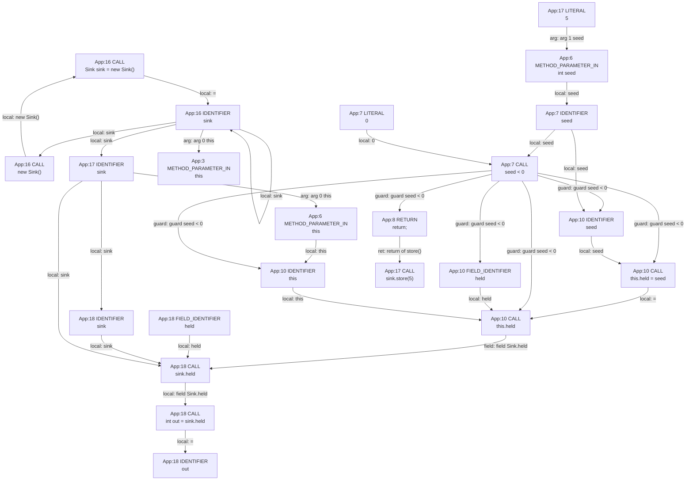

# voidReturn: spike value graph

```mermaid
flowchart TD
  n0["App:10 CALL<br/>this.held"]
  n1["App:10 CALL<br/>this.held = seed"]
  n2["App:10 FIELD_IDENTIFIER<br/>held"]
  n3["App:10 IDENTIFIER<br/>seed"]
  n4["App:10 IDENTIFIER<br/>this"]
  n5["App:16 CALL<br/>Sink sink = new Sink()"]
  n6["App:16 CALL<br/>new Sink()"]
  n7["App:16 IDENTIFIER<br/>sink"]
  n8["App:17 CALL<br/>sink.store(5)"]
  n9["App:17 IDENTIFIER<br/>sink"]
  n10["App:17 LITERAL<br/>5"]
  n11["App:18 CALL<br/>int out = sink.held"]
  n12["App:18 CALL<br/>sink.held"]
  n13["App:18 FIELD_IDENTIFIER<br/>held"]
  n14["App:18 IDENTIFIER<br/>out"]
  n15["App:18 IDENTIFIER<br/>sink"]
  n16["App:3 METHOD_PARAMETER_IN<br/>this"]
  n17["App:6 METHOD_PARAMETER_IN<br/>int seed"]
  n18["App:6 METHOD_PARAMETER_IN<br/>this"]
  n19["App:7 CALL<br/>seed #lt; 0"]
  n20["App:7 IDENTIFIER<br/>seed"]
  n21["App:7 LITERAL<br/>0"]
  n22["App:8 RETURN<br/>return;"]
  n0 -->|"field: field Sink.held"| n12
  n1 -->|"local: ="| n0
  n10 -->|"arg: arg 1 seed"| n17
  n11 -->|"local: ="| n14
  n12 -->|"local: field Sink.held"| n11
  n13 -->|"local: held"| n12
  n15 -->|"local: sink"| n12
  n17 -->|"local: seed"| n20
  n18 -->|"local: this"| n4
  n19 -->|"guard: guard seed #lt; 0"| n0
  n19 -->|"guard: guard seed #lt; 0"| n1
  n19 -->|"guard: guard seed #lt; 0"| n2
  n19 -->|"guard: guard seed #lt; 0"| n22
  n19 -->|"guard: guard seed #lt; 0"| n3
  n19 -->|"guard: guard seed #lt; 0"| n4
  n2 -->|"local: held"| n0
  n20 -->|"local: seed"| n19
  n20 -->|"local: seed"| n3
  n21 -->|"local: 0"| n19
  n22 -->|"ret: return of store()"| n8
  n3 -->|"local: seed"| n1
  n4 -->|"local: this"| n0
  n5 -->|"local: ="| n7
  n6 -->|"local: new Sink()"| n5
  n7 -->|"arg: arg 0 this"| n16
  n7 -->|"local: sink"| n6
  n7 -->|"local: sink"| n7
  n7 -->|"local: sink"| n9
  n9 -->|"arg: arg 0 this"| n18
  n9 -->|"local: sink"| n12
  n9 -->|"local: sink"| n15
```
