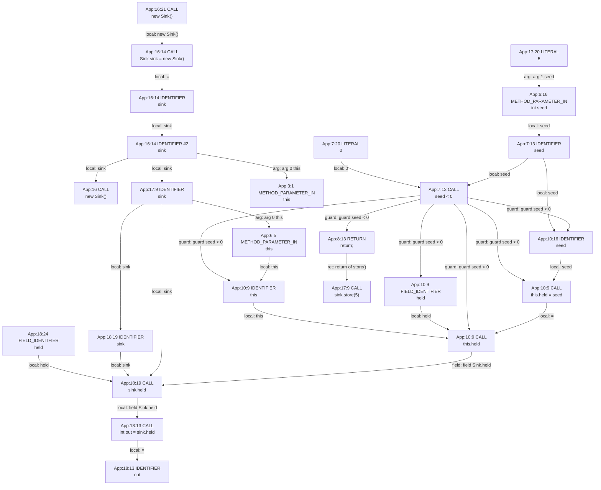

# voidReturn: spike value graph

```mermaid
flowchart TD
  n0["App:10:16 IDENTIFIER<br/>seed"]
  n1["App:10:9 CALL<br/>this.held"]
  n2["App:10:9 CALL<br/>this.held = seed"]
  n3["App:10:9 FIELD_IDENTIFIER<br/>held"]
  n4["App:10:9 IDENTIFIER<br/>this"]
  n5["App:16 CALL<br/>new Sink()"]
  n6["App:16:14 CALL<br/>Sink sink = new Sink()"]
  n7["App:16:14 IDENTIFIER #2<br/>sink"]
  n8["App:16:14 IDENTIFIER<br/>sink"]
  n9["App:16:21 CALL<br/>new Sink()"]
  n10["App:17:20 LITERAL<br/>5"]
  n11["App:17:9 CALL<br/>sink.store(5)"]
  n12["App:17:9 IDENTIFIER<br/>sink"]
  n13["App:18:13 CALL<br/>int out = sink.held"]
  n14["App:18:13 IDENTIFIER<br/>out"]
  n15["App:18:19 CALL<br/>sink.held"]
  n16["App:18:19 IDENTIFIER<br/>sink"]
  n17["App:18:24 FIELD_IDENTIFIER<br/>held"]
  n18["App:3:1 METHOD_PARAMETER_IN<br/>this"]
  n19["App:6:16 METHOD_PARAMETER_IN<br/>int seed"]
  n20["App:6:5 METHOD_PARAMETER_IN<br/>this"]
  n21["App:7:13 CALL<br/>seed #lt; 0"]
  n22["App:7:13 IDENTIFIER<br/>seed"]
  n23["App:7:20 LITERAL<br/>0"]
  n24["App:8:13 RETURN<br/>return;"]
  n0 -->|"local: seed"| n2
  n1 -->|"field: field Sink.held"| n15
  n10 -->|"arg: arg 1 seed"| n19
  n12 -->|"arg: arg 0 this"| n20
  n12 -->|"local: sink"| n15
  n12 -->|"local: sink"| n16
  n13 -->|"local: ="| n14
  n15 -->|"local: field Sink.held"| n13
  n16 -->|"local: sink"| n15
  n17 -->|"local: held"| n15
  n19 -->|"local: seed"| n22
  n2 -->|"local: ="| n1
  n20 -->|"local: this"| n4
  n21 -->|"guard: guard seed #lt; 0"| n0
  n21 -->|"guard: guard seed #lt; 0"| n1
  n21 -->|"guard: guard seed #lt; 0"| n2
  n21 -->|"guard: guard seed #lt; 0"| n24
  n21 -->|"guard: guard seed #lt; 0"| n3
  n21 -->|"guard: guard seed #lt; 0"| n4
  n22 -->|"local: seed"| n0
  n22 -->|"local: seed"| n21
  n23 -->|"local: 0"| n21
  n24 -->|"ret: return of store()"| n11
  n3 -->|"local: held"| n1
  n4 -->|"local: this"| n1
  n6 -->|"local: ="| n8
  n7 -->|"arg: arg 0 this"| n18
  n7 -->|"local: sink"| n12
  n7 -->|"local: sink"| n5
  n8 -->|"local: sink"| n7
  n9 -->|"local: new Sink()"| n6
```
