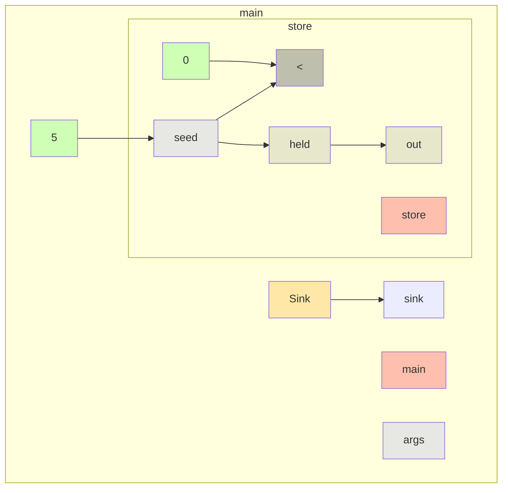

```mermaid
flowchart TD
  subgraph b0["main"]
    n1[main]:::RETURN
    n2[args]:::FUNC_PARAM
    n3[sink]:::OBJ_VARIABLE
    n4[Sink]:::EXTERNAL
    n5[5]:::LITERAL
    n12[out]:::VARIABLE
    n4[Sink]:::EXTERNAL --> n3[sink]:::OBJ_VARIABLE
    n5[5]:::LITERAL --> n8[seed]:::FUNC_PARAM
    subgraph b6["store"]
      n7[store]:::RETURN
      n8[seed]:::FUNC_PARAM
      n9[0]:::LITERAL
      n10[<]:::BIN_OP
      n11[held]:::VARIABLE
      n8[seed]:::FUNC_PARAM --> n10[<]:::BIN_OP
      n8[seed]:::FUNC_PARAM --> n11[held]:::VARIABLE
      n9[0]:::LITERAL --> n10[<]:::BIN_OP
      n11[held]:::VARIABLE --> n12[out]:::VARIABLE
    end
  end
  classDef LITERAL fill:#00FF0030
  classDef VARIABLE fill:#80808030
  classDef BIN_OP fill:#80808080
  classDef FUNC_PARAM fill:#8080FF30
  classDef RETURN fill:#FF808080
  classDef EXTERNAL fill:#FFA50040
```
